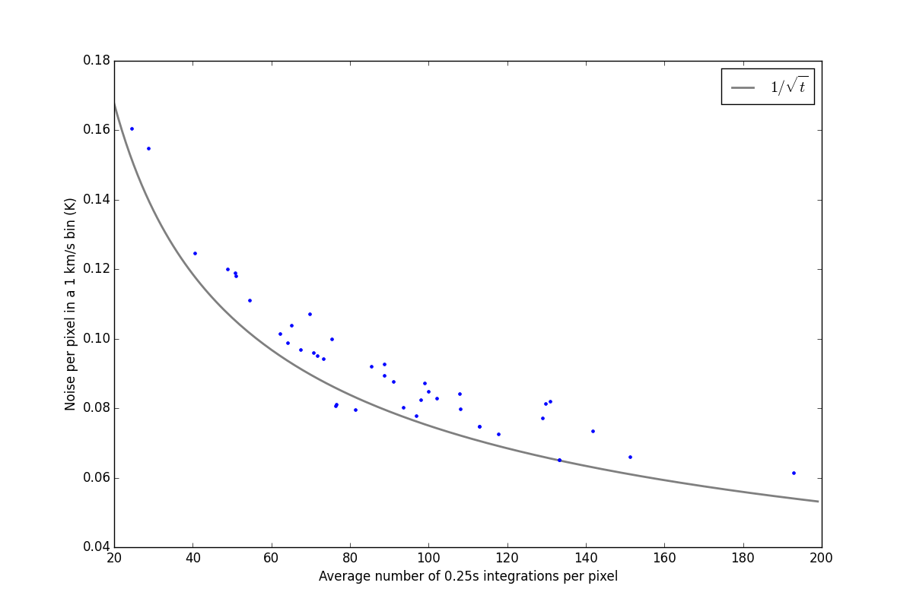

APEX_CMZ_H2CO
=============

[Data: On the Dataverse](http://thedata.harvard.edu/dvn/dv/APEX-CMZ-1mm/faces/study/StudyPage.xhtml?globalId=doi:10.7910/DVN/27601&versionNumber=1)
(permissions required; e-mail adam.g.ginsburg@gmail.com)

Observing scripts and logs from the 2013-2014 APEX survey of 218 GHz H2CO in
the CMZ 

The MPI and ESO observing scripts are in their respective directories.  A few
"emission-free" off positions were selected based on the Dame 2001 data.
Run [off_position_selection.py](off_position_selection.py) to generate a diagram
demonstrating this (it will automatically download the necessary data).  One
can also demonstrate that these are relatively emission-free using the [Bell
Labs 7m 12CO 1-0 data](http://files.figshare.com/1216354/GC_12CO_LVcube.fits),
with apologies for the FITS header.

The off positions are green X's in this map, with two additional blue points
identified by Jens Kauffmann and Walker Lu:

Note that Jens' point reportedly showed some signal around SiO, while Walker's
did not.

Here are the target regions colored by their association with the selected off
position:

August 21 observing stats:

Pipeline
========

An [example run of the pipeline](https://rawgit.com/keflavich/63b33d71a109e294bc4c/raw/835dec4970db738b2fb68e9070084c4180dd1053/ExampleAPEXMappingReduction.html)
is hosted on [gist](https://gist.github.com/keflavich/63b33d71a109e294bc4c).

Badges
======

